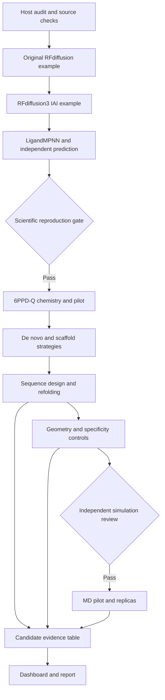

# 6PPD-Quinone-Build
A work flow to use various protein design tools to develop computational candidates at binding 6PPD-Quinone

## Architecture

```mermaid
flowchart TD
  A[Host audit and source checks] --> B[Original RFdiffusion example]
  B --> C[RFdiffusion3 IAI example]
  C --> D[LigandMPNN and independent prediction]
  D --> E{Scientific reproduction gate}
  E -->|Pass| F[6PPD-Q chemistry and pilot]
  F --> G[De novo and scaffold strategies]
  G --> H[Sequence design and refolding]
  H --> I[Geometry and specificity controls]
  I --> J{Independent simulation review}
  J -->|Pass| K[MD pilot and replicas]
  H --> L[Candidate evidence table]
  I --> L
  K --> L
  L --> M[Dashboard and report]
```
